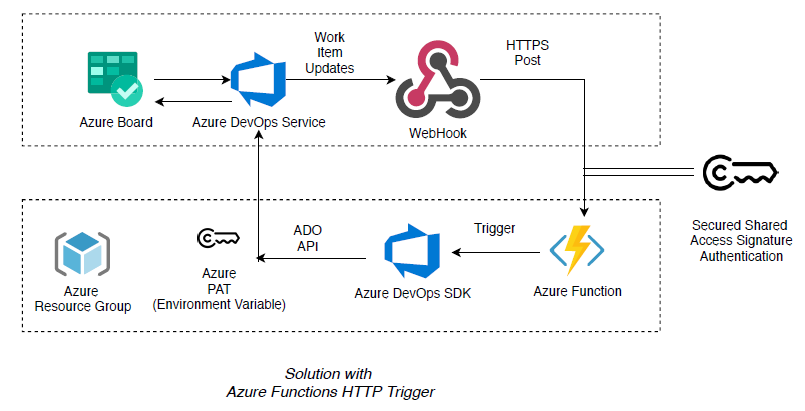

# Azure Boards - Automate State Transitions (Serverless Azure Functions Version)

Deze applicatie is geforked van een publieke [GitHub Repo](https://github.com/bbarman4u/azure-boards-automate-state-transition-serverless)

Deze applicatie is een Azure Function die automatisch de velden van een work item in Azure DevOps aanpast op basis van de status van de child work items of vice versa.
Op het moment ondersteund de applicatie voornamelijk de velden State en Iteration Path, maar in feite kan elk veld aangepast worden.

## Architectuur
 

## Setup
### Overview
* Kloon of fork deze repository en definieer uw aangepaste regels voor het afhandelen van uw scenario's voor work items, afhankelijk van het proces dat u gebruikt, zoals scrum, agile, enz. (gedetailleerde stappen hieronder)

* Maak een nieuwe Azure DevOps [Personal Access Token](https://docs.microsoft.com/en-us/azure/devops/organizations/accounts/use-personal-access-tokens-to-authenticate) aan met de machtigingen "Work items (read, write en manage)".

* Implementeer het project als een Azure Function App met runtime stack ".NET 8" op Linux of Windows, zodat het beschikbaar is vanuit de Azure DevOps-instantie. (gedetailleerde stappen hieronder)

* Maak de volgende omgevingsvariabelen aan voor de function app in de Azure Portal of via een van de CLI-opties, of voor lokaal development, zet ze in de local.settings.json:
  "AdoOptions": {
    "Pat": "`<PAT TOKEN>`",
    "ProcessType": "Scrum - Solution Development",
    "Organization": "weareinspark"
  },

* Het is raadzaam om per veld een webhook te maken om kosten te voorkomen die worden gemaakt door de functie te activeren bij elke veldwijziging.

   

* Vul het URL-veld in met de URL van de geïmplementeerde function app en selecteer de onderstaande eigenschappen:
    - Resourcegegevens om te verzenden: Alles
    - Berichten om te verzenden: Alles
    - Gedetailleerde berichten om te verzenden: Alles

### Hoe pas je de regelsets aan?

* Maak een map aan voor het proces type onder de map `rules`.
    * Belangrijk - Het work item type moet exact overeenkomen met het type dat wordt verzonden in het JSON-verzoek in Azure DevOps.
    * Voorbeeld - 
        - maak de map `rules\scrum` aan
        - plaats regels voor taak als `rule.task.json`
        - plaats regels voor bug als `rule.bug.json`
        - vergeet niet de omgevingsvariabele `ProcessType` in te stellen voor het gewenste proces, in dit voorbeeld `scrum`

* Werk de regels bij in het JSON-configuratiebestand voor elk child work item type. Er is een invoer nodig voor elke status volgens onderstaande conventies. [Referentie voor verschillende statussen per proces type](https://docs.microsoft.com/en-us/azure/devops/boards/work-items/guidance/choose-process?view=azure-devops&tabs=basic-process)

     - **`affectedType`**: Work Item type dat reageert op de status van de actor
     - **`ifActorFieldType`** Het veldtype van het work item dat de actie in gang zet
     - **`andActorFieldValue`** De waarde van het veldtype van het work item dat de actie in gang zet
     - **`whereAffectedFieldType`** Het veldtype van het work item dat wordt beïnvloed
     - **`andNotAffectedFieldValues`** De waarden die uitsluiten dat het werkitem wordt beïnvloed
     - **`setAffectedFieldValueTo`** De waarde die moet worden ingesteld voor het veldtype van het work item dat wordt beïnvloed
     - **`IsAllActors`** Als dit veld is ingesteld op `true`, wordt de alleen uitgevoerd als alle siblings van de actor aan dezelfde voorwaarde voeldoen.`
